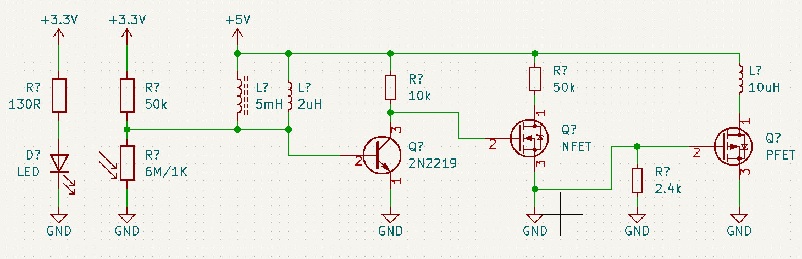
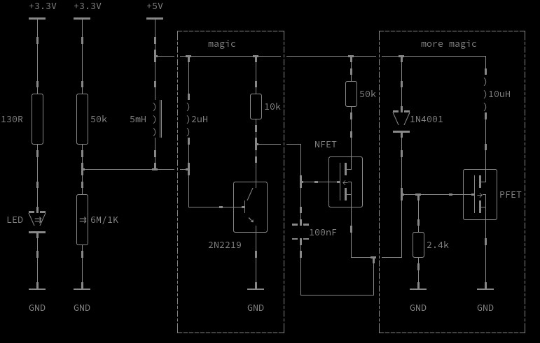

# Kicad to Unicode Renderer

## Quick start:

run `./kicad2unicode.py my_schematic.kicad_sch`

## How it works

Parsing the kicad schematics files is reasonably simple as they are human readable (well ascii at least) and based on nested blocks.

They provide location information for every component as well as orientation. Also kicad uses a regular grid for placing components which can be easily mapped to a character grid.

## Example

## Scope

It seems that rendering resistors, inductors, capacitors etc. in unicode is only really possible if they are oriented vertically due to the non-square characters.
You obviously need a monospace font to get a meaningful result.
The amount of symbols supported so far is limited. One problem about BJTs is that kicad does not encode their polarity in the name, thus right now we render them all as NPN...
