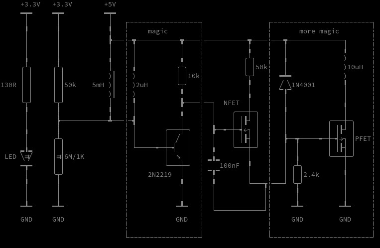

# Kicad to Unicode Renderer

## Quick start:

run `./kicad2unicode.py my_schematic.kicad_sch`

## How it works

Parsing the kicad schematics files is reasonably simple as they are human readable (well ascii at least) and based on nested blocks.

They provide location information for every component as well as orientation. Also kicad uses a regular grid for placing components which can be easily mapped to a character grid.

## Example

## Scope

The library currently supports 8, 16, 32 and 64 bit signed and unsigned types as well as floats and doubles.

All basic arithmetic operators are supported as well as bitwise operators for integer types and square roots for floating point types.

Comparisons and masking are supported as well, but shuffling as well as other selections based on comparison results still need to be implemented
